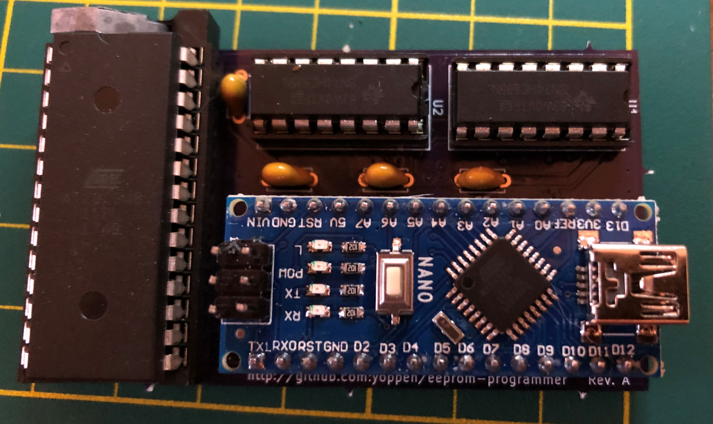

# eeprom-programmer
An Arduino Nano sketch and schematic for an Atmel 28cx programmer. I specifically designed this for an 8kx8 eeprom (AT28C64B-15PU). If you're using a different size, you'll have to adjust everything 
for the extra/fewer address lines, of course.

The Arduino Nano sketch implements a serial interface to the programmer. It accepts one-letter commands:
- e - erase the program
- f - fill eeprom with incrementing bytes
- h - help (this) text
- l - lock the eeprom against writes
- r - read and dump eeprom contents
- s - software info
- u - unlock eeprom writes
- x - xmodem transfer binary file to eeprom

Any standard terminal program can be used to talk to the programmer. I use the following:
- [serial](http://www.decisivetactics.com/products/serial/) for the Mac
- [teraterm](https://ttssh2.osdn.jp/index.html.en) for Windows
- [minicom](https://linux.die.net/man/1/minicom) for Linux

The programmer uses standard x-modem, as provided by any respectable terminal program—and certainly all of the
above listed terminal programs, to put binary files onto the eeprom. No other software is required. The programmer
will verify every 64 bytes as they are written (the size of an internal eeprom page).

Although the eeprom chips are supposed to come from the factory unlocked, I've heard stories of some chips being
purchased off ebay that arrive locked. Try doing an unlock on a chip if you have problems writing to it.

The circuit comes from [Ben Eater](https://youtu.be/K88pgWhEb1M).

Here is a fresh board, built up after receipt from Osh Park.
